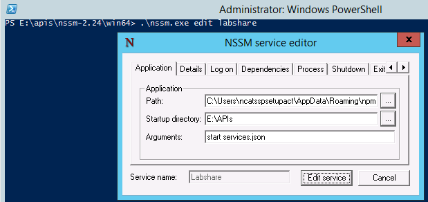
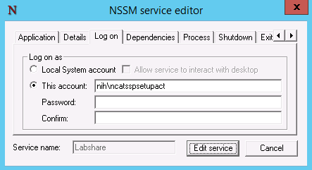
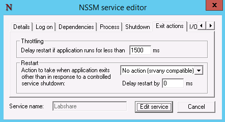
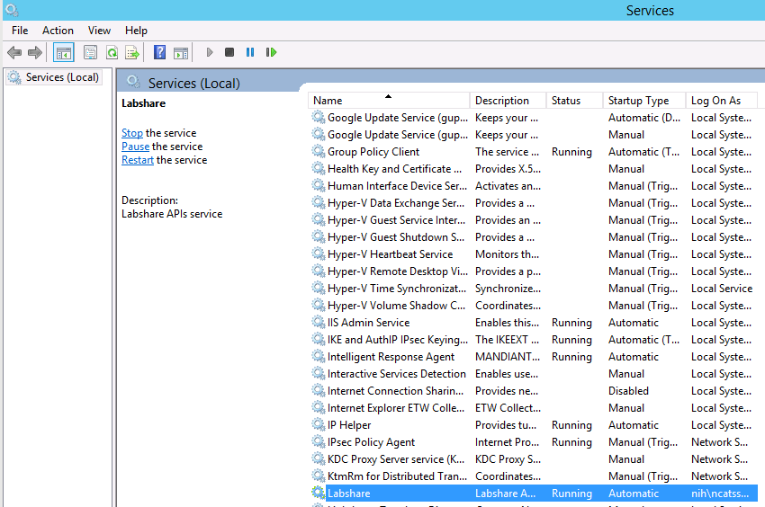

## Using NSSM

[NSSM](https://nssm.cc/) is a service helper for Windows.  It allows you to
configure services to start automatically at boot time.  Follow the
instructions below to use NSSM to automatically start PM2 at boot time, which
will in turn start the services configured in a process file, such as
services.json.

### Download NSSM

Choose a directory and [download NSSM](https://nssm.cc/download).  Unzip the
zip file.  It should unzip to a directory called *nssm-2.24*, for example.

### Install a New Service

Change into the `win64/` subdirectory and run the *nssm* executable:

```
cd nssm-2.24/win64
./nssm.exe install <service>
```

Replace **<service>** with the name of the service you would like to configure.

#### Configure the Application



For **Path**, choose a path to `pm2.cmd`.  It is typically installed here:
`C:\Users\<svcAccount>\AppData\Roaming\npm\pm2.cmd`.  Be sure to replace
*svcAccount* with the actual service account or AA Account that this service
should run as.  The user account should at least have the necessary privileges
to start the application.

For **Startup directory**, choose a path where the PM2 process file is located.
The process file in this example is *services.json* and is located in `E:\APIs`.

For **Arguments**, choose the arguments you would normally use with PM2: `start
services.json`.

Be sure to format the *services.json* file properly on Windows.  **The slashes
are backwards.** For example:

```
{
  "apps": [

    {
      "script": "C:/Users/ncatsspsetupact/AppData/Roaming/npm/node_modules/lsc/lib/bin/lsc.js",
      "name": "LabShare-Services-v16.1020",
      "args": "services start",
      "cwd": "E:/APIS/16.1020",
      "force": true
    }

  ]
}
```

#### Configure the User



The *Log on* tab is automatically populated with the current user account.  If
this needs to change, change it here.


#### Configure the Exit Actions



Change the *Restart* action to **No action**.  This will prevent PM2 in this
case from restarting infinitely if it encounters an error at start time.

Lastly, click **Install Service** to install the service in the Windows Startup Applications.

### Verify Service



Go to *Administrative Tools -> Services* and verify that the service was
installed.  For good measure, restart the service from the Services console and
verify using PM2 on the command line or from a browser that the API service is
running.
